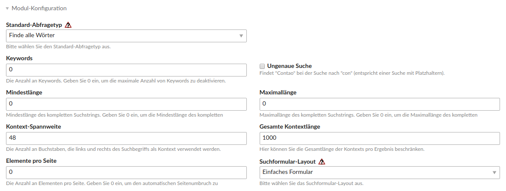

Search Bundle
================

Das Search Bundle erweitert das Contao Suchmaschinen Modul um drei Felder, mit denen man die Suche auf seiner Seite konfigurieren kann. 
* Keywords: zum festlegen der maximalen Anzahl der Keywords in einem Suchstring
* Mindestlänge: definiere die minimale Länge eines Suchstrings
* Maximallänge: definiere die maximale Länge eines Suchstrings

---

The search bundle extends the Contao search engine module by three fields with which you can configure the search on your page.
* Keywords: to specify the max number of keywords in a search string
* Minimum Length: define the minimum length of a search string
* Maximum Length: define the maximum length of a search string

Screenshots
-----------

Erweitertes Suchmaschinen Modul / Extended search engine module

Installation
------------

Install the extension via composer: [trilobit-gmbh/contao-search-bundle](https://packagist.org/packages/trilobit-gmbh/contao-search-bundle).

Compatibility
-------------

- Contao version ~4.4